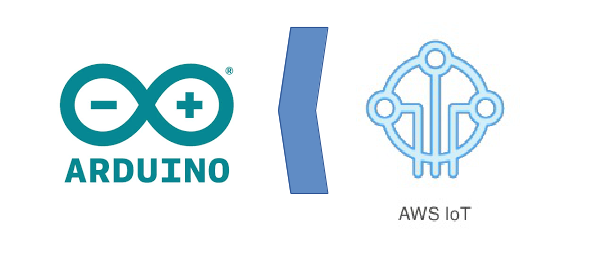
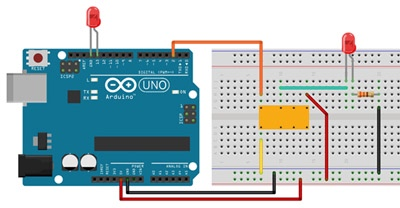
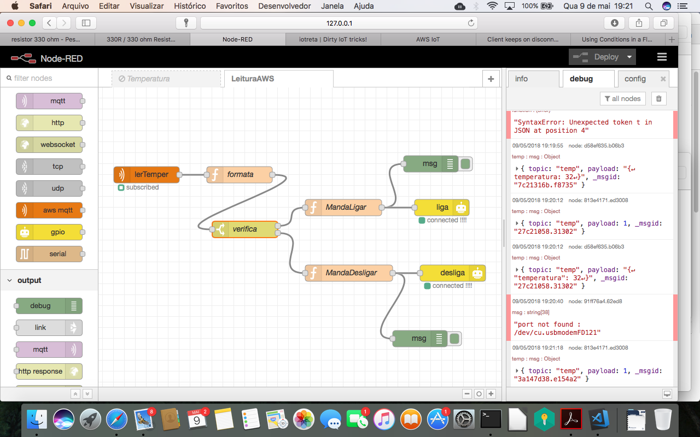
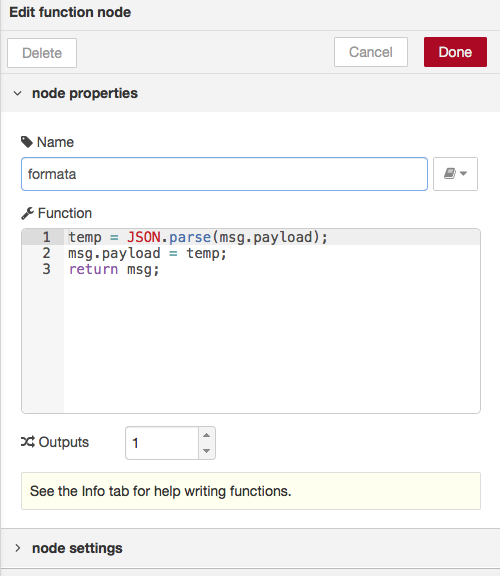
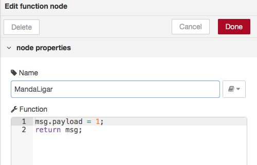
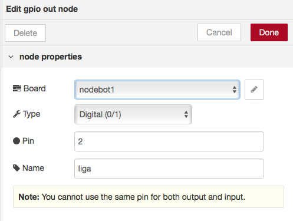

# IoTreta
Dirty IoT tricks!
[**Cleuton Sampaio**](https://github.com/cleuton)

# O caminho de volta



No [tutorial passado](../DiretoParaAmazon) mostrei como enviar as medições de temperatura para o [**MQTT Broker**](http://mqtt.org/) da Amazon (AWS IoT). Um dispositivo (**Arduino**) conectado a um controlador (um PC ou um **Raspberry PI**) coleta os dados do sensor e envia para um **tópico** do Broker.

Do MQTT Broker, podemos pegar as mensagens subscrevendo nos tópicos. E podemos armazenar em banco de dados, rodar análises de **Bigdata** e expor via Web ou mobile. Na verdade nem precisaríamos utilizar o MQTT da Amazon, pois existem vários provedores de MQTT Brokers na nuvem, e podemos instalar um em nossa rede interna.

## Outra opção é controlar outro dispositivo!

Sim, ai está o valor de uma rede de IoT! As "coisas" se comunicando via Internet. Foi daí que surgiu o termo **IoT** (Internet of Things).

Neste artigo, mostrarei o caminho contrário, ou seja, um dispositivo subscrevendo um tópico do Broker e atuando, de acordo com a resposta.


Neste exemplo, o **fluxo** NodeRed se conecta ao AWS MQTT, utilizando um nó [**aws MQTT in**](https://flows.nodered.org/node/node-red-contrib-aws-iot-hub) e subscreve no tópico "temp". Sempre que alguma mensagem for postada neste tópico, ele a receberá, analisará a temperatura e, se for maior do que 30 graus, acionará o relê. 

## O que o relê fará?

Bom, relês são chaves eletromagnéticas que podem acionar circuitos de diferentes correntes. É possível, por exemplo, acionar ventiladores industriais, alarmes ou mesmo abrir comportas de resfriamento. Por exemplo, um relê como o da foto abaixo pode fazer um arduíno (que usa no máximo 5 V) controlar um dispositivo de até 220 V): 


Como os circuitos são separados, a alta voltagem jamais circulará no seu Arduino. 

Inicialmente, pensei em usar um destes e acionar um ventilador caseiro, destes que ligamos na tomada comum (127 V). Mas o risco de lidar com alta voltagem é igualmente alto, e um erro pode provocar curto-circuito, incêndios e ferimentos. Então, resolvi usar um relê mais simples, de um só canal, controlando apenas um circuito de 5V, que aciona um Led. Se você quiser, pode adaptar para outros usos, mas atenção: **Lidar com alta voltagem pode ser perigoso. Só faça se tiver conhecimento e tomando os devidos cuidados!**

## A protoboard

Montei uma protoboard partindo do circuito básico do [**Guia do Arduino**](https://multilogica-shop.com/download_guia_arduino) da [**Multilógica Shop**](https://multilogica-shop.com). Baixe o guia e monte o exemplo da página 113, cuja imagem reproduzo aqui: 



Vocẽ pode dispensar o segundo Led, que está no pino 13 do Arduíno. Siga as instruções e teste com a IDE do Arduíno, para saber se está funcionando. 

Eis a foto do meu circuito:


É só conectar 5V, GND e o pino 2 ao Arduino e pronto!

## Configuração no AWS IoT

Se você seguir a configuração do [**artigo anterior**](../DiretoParaAmazon) tudo vai funcionar. Se for ligar dois dispositivos ao AWS IoT, o que faremos em breve, é melhor criar duas "coisas" separadas na Amazon. Mas, para fazermos apenas um tutorial, basta desativar o fluxo anterior e usar as mesmas configurações. 

Mas tem uma coisa que você precisa fazer na console AWS IoT: Mudar a política (policy) para permitir leitura de mensagens. Na console AWS IoT, abra o menu "Security / Policies" e edite a sua "policy" para ficar deste jeito: 

```
{
  "Version": "2012-10-17",
  "Statement": [
    {
      "Effect": "Allow",
      "Action": "iot:Connect",
      "Resource": "*"
    },
    {
      "Effect": "Allow",
      "Action": "iot:Publish",
      "Resource": "arn:aws:iot:us-east-1:xxxxxxx:topic/temp"
    },
    {
      "Effect": "Allow",
      "Action": "iot:Subscribe",
      "Resource": "*"
    },
    {
      "Effect": "Allow",
      "Action": "iot:Receive",
      "Resource": "*"
    }

  ]
}
```
Mudei o **Resource** da **Action** **iot:Subscribe** para qualquer recurso ("*") e acrescentei uma **Action** para permitir a leitura da mensagem (iot:Receive).

## O Fluxo Node-Red

O fluxo é um pouco mais complexo que o anterior, e também está aqui nos arquivos deste tutorial. Você pode copiar e colar ou pode construir manualmente.

O arquivo fonte do fluxo [**está aqui no Github!**](./LeituraAWS.node). Para importar, abra o NodeRed, clique no menu (canto superior direito) e escolha import / clipboard, copiando o arquivo todo e colando nele.



Os nós são esses, da esquerda para a direita, de cima para baixo: 

1. "**lerTemper**" (aws mqtt in): Conecta ao MQTT da Amazon, utilizando os certificados, e subscreve no tópico "temp". Devolve a mensagem como **string** dentro de **msg.payload**;
2. "**formata**" (function): Transforma o **string** do msg.payload em objeto JSON, pegando a propriedade "temperatura" e jogando em msg.payload;
3. "**verifica**" (switch): Desvia para o primeiro caminho se a temperatura for maior que 30, e para o segundo, se for menor ou igual a 30;
4. "**MandaLigar**" (function): Coloca "1" em msg.payload, para que o próximo nó ligue o pino 2, do **relê**;
5. "**MandaDesligar**" (function): Coloca "0" em msg.payload, para que o próximo nó ligue o pino 2, do **relê**;
6. "**Liga**" (gpio out): Envia para o pino 2 o valor de msg.payload;
7. "**desliga**" (gpio out): Envia para o pino 2 o valor de msg.payload;

O nó "**lerTemper**" é extremamente simples, só precisamos configurar indicando qual é o endpoint AWS e qual é o caminho dos certificados. Lembre-se que o **Client ID** tem que ser o nome dos arquivos de certificado. Já vimos isso no tutorial anterior.

Eis o código da função **formata**:



O cliente AWS IoT da console AWS, que estou utilizando, formata a mensagem como **string**. Eu estou postando manualmente o mesmo JSON que o dispositivo de medição postará:
```
{ "temperatura": <valor da temperatura>}
```
Só que ele transforma isso em **string**. Utilizando **JSON.parse()** eu transformo novamente em objeto, recupero a propriedade **temperatura** e coloco no msg.payload para o próximo nó analisar.

O nó **switch** (verifica) é interessante:


Eu coloquei dois caminhos, baseados na informação que virá no **msg.payload**. Um deles ligará o relé e o outro o desligará.

O nó **MandaLigar** é semelhante ao nó **MandaDesligar**. No MandarLigar, eu simplesmente coloco "1" em msg.payload:



O nó "**Ligar** e o nó "**Desligar**" são iguais. Precisamos configurar um **nodebot** indicando a porta serial da placa, como já fizemos no exemplo passado. 



## Ecco!

Uma foto vale mais do que mil palavras... Na foto abaixo, eu digitei uma mensagem, que foi recebida pelo fluxo e acionou o relê, mandando energia para o circuito do Led: 


## Mas eu preciso de um PC para isso?

Não! Eu poderia (e vou mostrar como) usar um **Raspberry PI**. Uma das configurações é ter um **Raspi** controlando um ou mais **Arduinos**, ou então o próprio **Raspi** sozinho. O Arduino é mais flexível e, por ser um microcontrolador, funciona em tempo real. 

Além disso, o **Raspi** só tem portas digitais. Se precisamos conectar um componente analógico, precisaremos de um conversor A/D. Neste exemplo de temperatura, é o que aconteceria, pois o **termistor** é um componente analógico. Para usar o **Raspi** eu teria que usar um componente com saída digital, como o [**DHT 22**](https://www.filipeflop.com/produto/sensor-de-umidade-e-temperatura-am2302-dht22/).